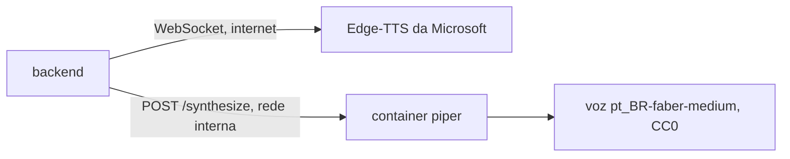

# ADR 0004: Voz local com Piper em serviço separado, escolhida por usuário e com fallback automático do Edge-TTS

* **Status:** Aceito
* **Data:** 2026-09-24
* **Autor:** Nicholas / SINA_IA Core Team

---

## 1. Contexto do Problema

Todo áudio da plataforma sai de `app/services/tts_service.py`, que usa a biblioteca `edge-tts`. Ela
parece local, mas não é: abre um WebSocket com `speech.platform.bing.com`, o serviço de leitura em voz
alta do navegador Edge, e a voz neural roda nos servidores da Microsoft. Não pede chave nem conta, e
também não é uma API oficial com garantia de uso.

Isso traz três problemas para uma plataforma de acessibilidade:

* sem internet, ou se a Microsoft bloquear ou mudar o endpoint, nenhum material ganha áudio, e quem é
  cego perde a principal forma de estudar;
* o texto de cada material sai do servidor para a Microsoft, além de já sair para o Gemini ou o Groq;
* quem sobe a plataforma não tem como oferecer uma voz que funcione sem depender de terceiros.

O Piper é um motor de voz neural que roda em CPU, com vozes em português do Brasil. Duas restrições
estreitam a escolha:

* o pacote atual, `piper-tts` 1.8 (repositório `OHF-voice/piper1-gpl`), é **GPL-3.0-or-later**, e o
  SINA_IA não declara licença. Importar o Piper dentro do backend deixaria o backend distribuído sujeito
  à GPL;
* o Piper gera WAV, e o sistema inteiro serve MP3: as rotas `/api/audio` e
  `/api/materiais/{id}/audio`, o player e o nome do arquivo baixado.

A pergunta central: como oferecer uma voz que funcione sem internet, sem trocar a voz online para quem
já usa e sem prender o backend à GPL?

---

## 2. Alternativas Consideradas

* **Alternativa A: Continuar só com o Edge-TTS**
  * *Desvantagens:* o áudio continua dependendo de um endpoint não oficial da Microsoft e da internet.
    Uma queda derruba o áudio de todo mundo, e não existe opção para quem não quer mandar o texto para
    fora.

* **Alternativa B: Trocar o Edge-TTS pelo Piper para todos**
  * *Desvantagens:* as vozes neurais da Microsoft soam mais naturais que as vozes `medium` do Piper, e
    quem usa a plataforma perderia qualidade sem ter pedido. A imagem cresce para todo mundo, inclusive
    para quem nunca vai usar voz local.

* **Alternativa C: Piper importado dentro do backend (`PiperVoice.load`)**
  * *Desvantagens:* é o caminho com menos código, mas coloca código GPL no mesmo processo do backend,
    o que sujeita o backend distribuído à GPL-3.0. A imagem do backend ganha o `onnxruntime` e a voz.

* **Alternativa D: Binário do Piper antigo (`rhasspy/piper`, MIT) chamado por subprocesso**
  * *Desvantagens:* a licença é livre, mas o projeto foi arquivado e não recebe correções. Seria
    preciso manter um binário por arquitetura dentro da imagem.

* **Alternativa E: Piper como serviço separado no Docker, preferência por usuário e fallback nos dois
  sentidos**
  * *Vantagens:* o código GPL roda em outro processo e outro container, e o backend só faz uma
    chamada HTTP. Quem prefere a voz online continua com ela, e uma falha de um motor não deixa o
    material sem áudio.

---

## 3. Decisão Tomada

Adotar a **Alternativa E**.

1. **Serviço `piper` no `docker-compose.yml`**, com o servidor HTTP do próprio Piper
   (`python -m piper.http_server`) e a voz `pt_BR-faber-medium` (licença CC0, cerca de 63 MB). Ele só
   é exposto na rede interna do Compose.
2. **`tts_service.py` continua sendo o único módulo de voz.** Ele passa a ter dois motores: o Edge-TTS
   e uma chamada HTTP ao `piper` (`POST /synthesize`), com o endereço em `PIPER_URL` no
   `core/config.py`. O WAV do Piper vira MP3 no backend com o `lameenc` (encoder LAME), e por isso nada
   depois da síntese muda.
3. **Preferência por usuário:** o campo `tts_engine` (`online` ou `local`) nas preferências de
   acessibilidade, com padrão `online`, entra pela migração 0011 e aparece em Configurações →
   Acessibilidade.
4. **Fallback nos dois sentidos:** o motor preferido é tentado primeiro e, se falhar, o outro. Sem
   `PIPER_URL` configurada, só o Edge-TTS existe, como hoje.

A decisão foi tomada por Nicholas em 24/09/2026, com as escolhas de serviço separado, conversão para
MP3 e voz faber.

---

## 4. Consequências Arquiteturais

### Positivas:

* O áudio continua sendo gerado quando a internet ou o endpoint da Microsoft caem, desde que o
  container `piper` esteja de pé.
* Quem escolhe voz local não manda o texto do material para a Microsoft.
* O código GPL fica isolado num container próprio. O backend não importa o Piper.
* Rotas, player e downloads continuam em MP3, sem mudança de contrato.

### Negativas / Trade-offs:

* Mais um serviço para subir, monitorar e atualizar, e mais uns 63 MB de voz, mais o `onnxruntime`,
  na imagem do `piper`.
* A síntese local usa a CPU do servidor. Um material longo pode levar mais tempo que no Edge-TTS e
  compete com o resto do backend por processador.
* A voz padrão do Edge é feminina (Francisca) e a do Piper é masculina (faber). Quem cai no fallback
  ouve uma voz diferente da que está acostumado.
* A separação por processo é a leitura usual para não propagar a GPL, mas não é uma garantia jurídica.
  Se o projeto for distribuído comercialmente, vale confirmar com quem entende de licenças.
* Uma dependência nova no backend (`lameenc`), com licença LGPL da biblioteca LAME.

**Gatilho de reavaliação:** se o Piper mudar de licença ou deixar de ter vozes pt-BR mantidas, se a
síntese local ficar lenta demais para os materiais reais, ou se um terceiro motor de voz precisar
entrar, revisitar esta decisão antes de adicionar mais um motor no mesmo padrão.
