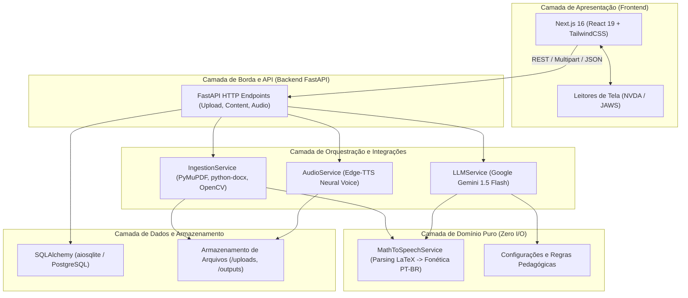

# Arquitetura do Sistema SINA_IA

Este documento descreve a visão geral da arquitetura de software, componentes e decisões estruturais do projeto **SINA_IA**.

---

## 1. Visão Geral

O SINA_IA adota uma arquitetura distribuída em **Monorepo Poliglota**, dividida em duas áreas fundamentais:

---

## 2. Responsabilidades por Camada

### 2.1. Frontend (`frontend/`)
* **Responsabilidade:** Interface acessível e inclusiva para estudantes e professores.
* **Tecnologias:** Next.js 16 (App Router), React 19, TypeScript 5, TailwindCSS v4.
* **Princípio:** Renderização semântica acessível via teclado e leitores de tela, exibição de Markdown didático e reprodução contínua de áudios gerados pela IA.
* **Isolamento:** Toda a comunicação externa é mediada por chamadas de API tipadas à camada backend.

### 2.2. Gateway e Rotas de Borda (`backend/app/app/main.py`)
* **Responsabilidade:** Recepção de requisições HTTP, validação de payloads via esquemas Pydantic, gerenciamento de sessões assíncronas do banco de dados e entrega de arquivos de mídia.
* **Princípio:** As rotas não devem conter lógica pesada de parsing matemático ou regras de negócio profundas; atuam como orquestradores entre os serviços e a persistência.

### 2.3. Serviços e Integrações (`backend/app/app/services/`)
* **`IngestionService`:** Extração estruturada de documentos `.pdf`, `.docx`, `.png`, `.jpg` e `.txt`. Realiza pré-processamento de imagens com OpenCV e fallback multimodal de OCR com a API do Gemini Vision.
* **`LLMService`:** Integração com o Google Gemini (`google-genai`), injetando parâmetros pedagógicos do professor (nível de dificuldade, tom e detalhamento de cálculos) e gerando resumos, quizzes comentados e guias de estudo.
* **`AudioService`:** Síntese de voz neural assíncrona utilizando `edge-tts` com a voz brasileira `pt-BR-AntonioNeural`.

### 2.4. Domínio Puro (`backend/app/app/services/math_speech_service.py`)
* **Responsabilidade:** Conversão determinística de expressões matemáticas em sintaxe LaTeX (`$...$` e `$$...$$`) em sentenças em português por extenso encapsuladas na marcação `[Equação: ...]`.
* **Princípio:** Não realiza chamadas assíncronas de rede, não lê nem escreve no disco e não depende de bibliotecas de banco de dados ou frameworks web.

### 2.5. Persistência (`backend/app/app/database.py`)
* **Responsabilidade:** Modelos de banco de dados e ciclo de vida de conexões relacionais usando SQLAlchemy assíncrono (`AsyncSession`).
* **Suporte:** Desenvolvido inicialmente sobre SQLite (`aiosqlite`) para facilitar o desenvolvimento local, compatível com migração transparente para PostgreSQL.

---

## 3. Fluxo de Processamento de Documentos

1. **Upload:** O usuário envia um documento didático via formulário multipart (`POST /api/documents/upload`).
2. **Triagem e Extração:**
   * Documentos nativos (PDF/Word/TXT) são convertidos para Markdown hierárquico.
   * Documentos escaneados ou imagens passam por grayscale no OpenCV e são processados via OCR do Gemini Vision, delimitando equações em LaTeX.
3. **Conversão Fonética:** O texto gerado é processado pelo motor de tradução fonética, garantindo que o leitor de tela receba descrições por extenso de qualquer termo matemático.
4. **Persistência:** Metadados, Markdown original e texto fonético acessível são gravados no banco de dados.
5. **Geração Adaptativa:** Mediante solicitação (`POST /api/content/generate`), a LLM cria o material personalizado e o serviço de áudio sintetiza a trilha MP3 para consumo auditivo.
