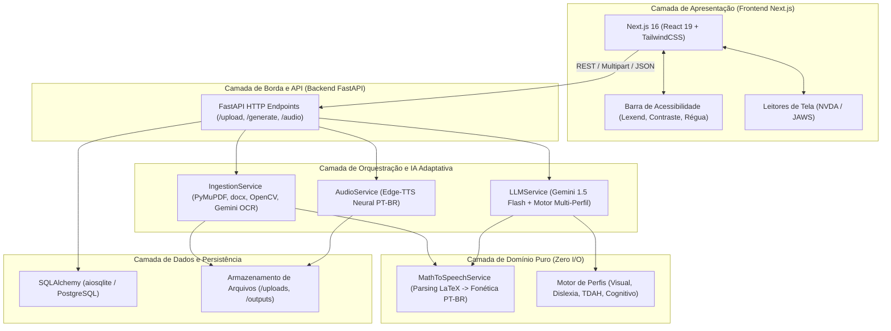

# Arquitetura do Sistema SINA_IA

Este documento descreve a visão geral da arquitetura de software, componentes e decisões estruturais do projeto **SINA_IA** — Plataforma Educacional Universalmente Acessível.

---

## 1. Visão Geral

O SINA_IA adota uma arquitetura em **Monorepo Poliglota**, projetada para transformar materiais de estudo em múltiplos formatos acessíveis adaptados a diferentes perfis sensoriais e neurodivergentes.

---

## 2. Responsabilidades por Camada

### 2.1. Frontend (`frontend/`)
* **Responsabilidade:** Interface inclusiva universal com controles de acessibilidade visual, auditiva e cognitiva.
* **Tecnologias:** Next.js 16 (App Router), React 19, TypeScript 5, TailwindCSS v4.
* **Recursos:** Tipografia adaptativa para dislexia (`Lexend`), ajustes de espaçamento e contraste, réguas de leitura para TDAH, suporte estrito a leitores de tela e áudio sincronizado.

### 2.2. Gateway e Rotas de Borda (`backend/app/app/main.py`)
* **Responsabilidade:** Roteamento HTTP, injeção de dependência do banco de dados, validação de requisições com esquemas Pydantic (`GenerateRequest` com `AccessibilityConfig`) e entrega de mídias.

### 2.3. Serviços de IA e Orquestração (`backend/app/app/services/`)
* **`IngestionService`:** Extração estruturada de documentos (.pdf, .docx, .png, .jpg, .txt), pré-processamento de imagens e OCR multimodal via Gemini Vision.
* **`LLMService`:** Orquestração pedagógica e multimodal no Google Gemini (`google-genai`). Modula os prompts conforme a necessidade do aluno:
  * **Visual:** Preservação estrita de LaTeX e hierarquia para leitor de tela.
  * **Dislexia:** Aplicação de Linguagem Simples (Plain Language), sentenças curtas e glossários.
  * **TDAH:** Fragmentação em micro-conteúdos concisos (*chunks* de leitura) e eliminação de rodeios.
  * **Cognitivo:** Analogias concretas e passos sequenciais simplificados.
* **`AudioService`:** Síntese neural de voz em português brasileiro (`pt-BR-AntonioNeural`) via `edge-tts`.

### 2.4. Domínio Puro (`backend/app/app/services/math_speech_service.py`)
* **Responsabilidade:** Conversão determinística de fórmulas matemáticas em descrições por extenso no padrão `[Equação: ...]`. Não realiza I/O nem chamadas de rede.

### 2.5. Persistência (`backend/app/app/database.py`)
* **Responsabilidade:** Persistência relacional assíncrona com SQLAlchemy (`aiosqlite`/PostgreSQL).
