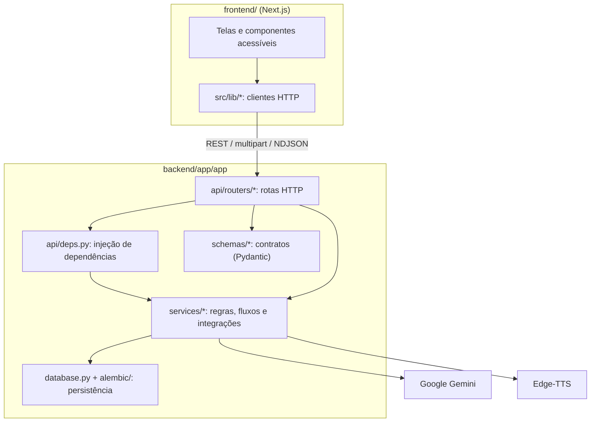

# Arquitetura do Sistema SINA_IA

Este documento descreve como o **SINA_IA** está organizado hoje: as aplicações, as pastas do backend, a responsabilidade de cada módulo e os fluxos que transformam um material de estudo em conteúdo acessível.

As decisões que levaram a essa estrutura estão em [`docs/adr/`](adr/).

---

## 1. Visão geral

O repositório é um monorepo com duas aplicações que conversam só por HTTP/JSON ([ADR 0001](adr/0001-arquitetura-monorepo-poliglota.md)):

- **`frontend/`**: Next.js 16 (App Router), React 19, TypeScript estrito e TailwindCSS v4.
- **`backend/app/`**: FastAPI (Python 3.13), SQLAlchemy assíncrono, Alembic, Google Gemini (`google-genai`), Edge-TTS, PyMuPDF e python-docx.



---

## 2. Organização do backend

Cada responsabilidade tem um único lugar. Não existe outro pacote de serviços fora de `app/services/`.

```
backend/app/app/
  main.py              cria o FastAPI, o CORS e registra os routers
  core/                config.py (Settings), security.py (JWT, Argon2), protocols.py
  database.py          engine, sessão e models do SQLAlchemy
  models.py            DTOs de geração de conteúdo (AccessibilityConfig, GenerateRequest)
  schemas/             DTOs das rotas: auth, user, exercise, material, accessibility
  api/
    deps.py            sessão do banco, usuário logado, RBAC e as instâncias dos serviços
    routers/           uma rota HTTP por arquivo (lista na seção 3)
  services/            regras, fluxos e integrações externas (lista abaixo)
backend/app/alembic/   migrações; o schema do banco só muda por elas
```

### 2.1. `app/services/`

| Módulo | Responsabilidade | Tipo |
|---|---|---|
| `gemini_service.py` | **Único** cliente do Google Gemini, assíncrono: texto, OCR, descrição de gráfico, auditoria e correção. Modelo em `Settings.GEMINI_MODEL`. | Integração |
| `tts_service.py` | **Único** serviço de voz (Edge-TTS). Voz, velocidade, volume e tom em `Settings.EDGE_TTS_*`. | Integração |
| `document_extractor.py` | **Único** extrator de documentos: PDF (texto nativo ou OCR por página), DOCX (títulos, parágrafos, tabelas e imagens), TXT e imagens. PyMuPDF e python-docx rodam fora do event loop. | Integração |
| `file_store.py` | Arquivos gerados, com `resolve_safe` contra path traversal e expiração opcional. | Integração |
| `accessibility_pipeline.py` | Fluxo completo de acessibilidade: extração, detecção de matemática, adaptação por nível (1 a 4), auditoria, correção e MP3. | Fluxo |
| `accessibility_prompts.py` | Prompts do pipeline (mestre, matemática, OCR, gráficos, auditoria e correção). | Fluxo |
| `llm_service.py` | Geração de resumo, quiz ou guia por perfil de acessibilidade e configuração do professor. | Fluxo |
| `ingestion_service.py` | Extração síncrona usada por `/api/documents/upload`; usa o `DocumentExtractor`. | Fluxo |
| `material_service.py` | Armazenamento e processamento em segundo plano dos materiais (`/api/materiais`), com cache por `sha256 + nível`. | Fluxo |
| `math_speech_service.py` | Conversão determinística de LaTeX para fala em português (`[Equação: ...]`). | Domínio puro |
| `math_detector.py` | Heurística que decide se um texto tem matemática relevante. | Domínio puro |
| `upload_validation.py` | Tipo do arquivo pela assinatura (não pela extensão), limites e nome seguro para exibição. | Domínio puro |
| `fakes.py` | Implementações falsas do LLM, do Gemini e do TTS para os testes. | Testes |

Módulos de **domínio puro** não fazem I/O e não importam FastAPI, SQLAlchemy nem clientes externos (ver [`docs/rules/domain.md`](rules/domain.md)).

### 2.2. Injeção de dependências

`app/api/deps.py` cria **uma instância** de cada integração (`GeminiService`, `TTSService`, `LLMService`, `IngestionService`) e a entrega às rotas por `Depends`. Nos testes, `app.dependency_overrides` troca essas instâncias pelos fakes de `app/services/fakes.py`, então a suíte não chama o Gemini nem o Edge-TTS.

### 2.3. Configuração

Toda configuração fica em `app/core/config.py` (`Settings`, lido do `backend/app/.env`). Nenhum outro módulo lê variáveis de ambiente diretamente.

---

## 3. Rotas HTTP

| Router | Prefixo | Uso |
|---|---|---|
| `health.py` | `/health`, `/api/health` | Verificação de saúde |
| `auth.py` | `/auth/*`, `/users/me*` | Cadastro (só `aluno` e `professor`), login, refresh token, logout e preferências |
| `documents.py` | `/api/documents` | Upload síncrono (legado, usado pelo `TeacherWorkspace`) |
| `materials.py` | `/api/materiais` | Upload com processamento em segundo plano, status, áudio protegido, reprocessar e apagar |
| `content.py` | `/api/content/generate` | Resumo, quiz ou guia por perfil (usado pelo `StudentWorkspace`) |
| `audio.py` | `/api/audio/{arquivo}` | MP3 gerado pelo `/api/content/generate` |
| `accessibility.py` | `/api/accessibility` | Pipeline com progresso em NDJSON (tela `/processar`) e download dos arquivos gerados |
| `exercises.py` | `/api/exercicios` | Sessões de quiz, respostas, resultado, geração por IA e publicação pelo professor |

Documentos e materiais com dono só são acessíveis pelo dono ou por um admin (`deps.can_access_document`). Para qualquer outra pessoa a resposta é 404, sem revelar que o recurso existe.

---

## 4. Fluxos de processamento

Os fluxos compartilham o mesmo extrator, o mesmo cliente Gemini e o mesmo serviço de voz. A unificação dos fluxos num pipeline só está em andamento no refactor do backend.

| Fluxo | Entrada | Etapas | Resultado |
|---|---|---|---|
| Pipeline de acessibilidade | `POST /api/accessibility/process-stream` | extração, detecção de matemática, adaptação por nível, auditoria, correção, MP3 | Eventos NDJSON; arquivos temporários com expiração |
| Materiais | `POST /api/materiais` | o mesmo pipeline, em tarefa de fundo | Linha em `documentos` com `status` (`enviado`, `processando`, `pronto`, `erro`) e MP3 permanente |
| Documento legado | `POST /api/documents/upload` | extração e matemática falada | Linha em `documentos` com `status = pronto` |
| Conteúdo | `POST /api/content/generate` | prompt por perfil, Gemini, matemática falada, MP3 | Texto, texto falado e URL do áudio |

---

## 5. Persistência

- `database.py` define as tabelas `usuarios`, `preferencias_acessibilidade`, `documentos`, `refresh_tokens`, `exercicios`, `sessoes_exercicio` e `respostas_exercicio`.
- O schema muda **só por migração** em `backend/app/alembic/versions/`. A API não cria tabelas ao iniciar, e o container do backend roda `alembic upgrade head` antes de subir.
- O `./check.sh` e o CI rodam `alembic check`, que falha quando um model muda sem migração correspondente.
- SQLite no desenvolvimento e nos testes; PostgreSQL opcional pelo `docker-compose.yml`.
