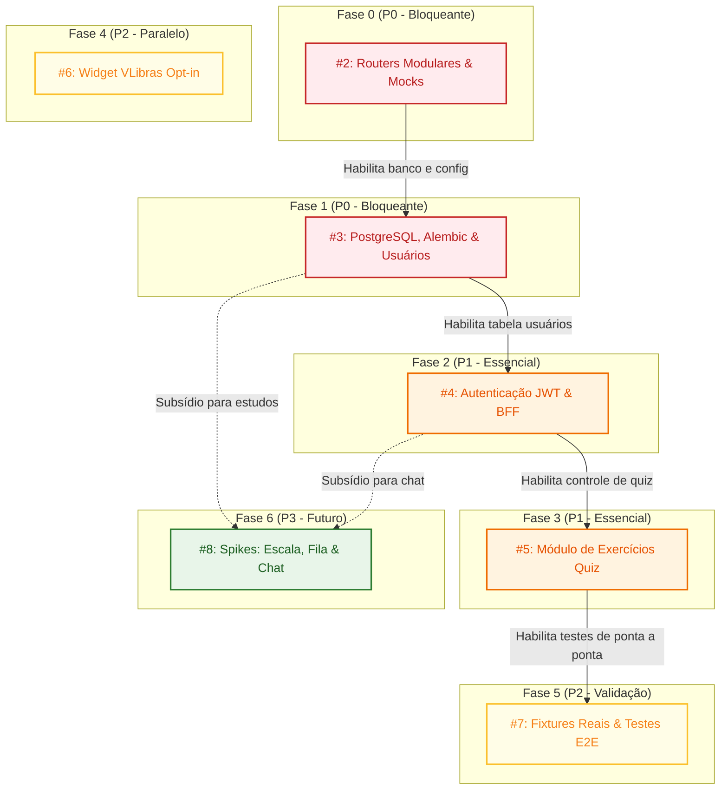

# Roadmap e Grafo de Dependências — SINA_IA

Este documento define a priorização estrita, a ordem de dependências e os pré-requisitos técnicos para a evolução do **SINA_IA (Projeto Fetin)**.

---

## 1. Grafo Visual de Dependências



---

## 2. Matriz de Prioridade e Dependência

| Issue | Fase | Prioridade | Depende de (Pré-requisito) | Bloqueia (Dependentes) | Status |
|---|---|---|---|---|---|
| [#2](https://github.com/elisaleao/SINA_IA/issues/2) | **Fase 0** | `P0 - Crítica` | *Nenhuma* (Ponto de entrada obrigatório) | #3, #4, #5, #7 | 🟢 **Pronta para execução (Next)** |
| [#3](https://github.com/elisaleao/SINA_IA/issues/3) | **Fase 1** | `P0 - Crítica` | #2 (Routers e config centralizada) | #4, #5 | 🔴 Aguardando #2 |
| [#4](https://github.com/elisaleao/SINA_IA/issues/4) | **Fase 2** | `P1 - Alta` | #3 (Postgres e tabela usuários) | #5 | 🔴 Aguardando #3 |
| [#5](https://github.com/elisaleao/SINA_IA/issues/5) | **Fase 3** | `P1 - Alta` | #4 (Autenticação e controle de perfis) | #7 | 🔴 Aguardando #4 |
| [#6](https://github.com/elisaleao/SINA_IA/issues/6) | **Fase 4** | `P2 - Média` | *Nenhuma no backend* (100% frontend) | *Nenhuma* | 🟢 **Desbloqueada (Independente)** |
| [#7](https://github.com/elisaleao/SINA_IA/issues/7) | **Fase 5** | `P2 - Média` | #2, #3, #4, #5 (Fluxos completos integrados) | Lançamento Fetin | 🔴 Aguardando Fases 0–3 |
| [#8](https://github.com/elisaleao/SINA_IA/issues/8) | **Fase 6** | `P3 - Baixa` | #3, #4 (Pesquisa técnica pós-MVP) | *Nenhuma* | 🟡 Backlog / Spikes |
| [#12](https://github.com/elisaleao/SINA_IA/issues/12) | **Fase UX1** | `P1 - Alta` | *Nenhuma* (Frontend isolado) | #13, #14, #15, #16 | 🟢 **Pronta para execução (Next Front)** |
| [#13](https://github.com/elisaleao/SINA_IA/issues/13) | **Fase UX2** | `P1 - Alta` | #12 (UX1.4, UX1.5) e #4 (Auth) | #14 | 🔴 Aguardando #12 e #4 |
| [#14](https://github.com/elisaleao/SINA_IA/issues/14) | **Fase UX3** | `P1 - Alta` | #12 (UX1) e #4 (Auth/Posse) | #16, #17 | 🔴 Aguardando #12 e #4 |
| [#15](https://github.com/elisaleao/SINA_IA/issues/15) | **Fase UX4** | `P1 - Alta` | #12 (UX1.5 Dropzone) | #16, #17 | 🟢 **Pronta para execução (Sem #4)** |
| [#16](https://github.com/elisaleao/SINA_IA/issues/16) | **Fase UX5** | `P2 - Média` | #14 (UX3.6) e #15 (UX4) | #17 | 🟡 UX5.1 pronta; restante aguarda #14 e #15 |
| [#17](https://github.com/elisaleao/SINA_IA/issues/17) | **Fase UX6** | `P1 - Alta` | #14 (UX3.1), #4 (Auth) e #5 (Fase 3) | Nenhuma | 🟡 Conteúdo pronto para iniciar |
| [#18](https://github.com/elisaleao/SINA_IA/issues/18) | **Fase UX7** | `P2 - Média` | #13, #14, #15, #17 | Nenhuma | 🟡 Contínua |

---

## 3. Justificativa Técnica da Ordem

1. **Por que a Fase 0 é P0 e Bloqueante de Tudo?**
   O `backend/app/app/main.py` atual concentra endpoints mistos. Tentar introduzir PostgreSQL ou JWT antes de separar os routers gera conflitos em cascata e dificulta testes. Além disso, a Fase 0 introduz `FakeLLMClient` e `FakeTTSClient`, permitindo rodar todos os testes de todas as fases subsequentes em milissegundos e sem gastar cota externa da Google Gemini.

2. **Por que a Fase 1 precede a Fase 2?**
   Autenticação segura necessita de persistência relacional com tipagem estrita para senhas (Argon2id), tokens de revogação de sessão e perfis de acessibilidade vinculados ao ID do usuário.

3. **Por que o VLibras (Fase 4) é independente?**
   A integração do VLibras é uma camada de apresentação puramente no frontend (`Next.js`) que funciona sob demanda (*opt-in*). Qualquer desenvolvedor de frontend pode implementá-la sem depender do progresso do backend.

---

## 4. Regra de Execução em Equipe

1. **Pegar uma tarefa:**
   * Atribua-se como *Assignee* na issue correspondente no GitHub.
   * Crie uma branch específica: `feature/fase-X-nome-da-tarefa`.
2. **Desenvolver e validar:**
   * Mantenha os testes automatizados passando.
   * Execute `./check.sh` localmente antes de enviar.
3. **Submeter e fechar:**
   * Abra o Pull Request referenciando o fechamento automático da issue no corpo:
     ```markdown
     Closes #X
     ```
   * O Quality Gate do CI executará automaticamente. Após revisão e merge, o GitHub encerrará a issue.

